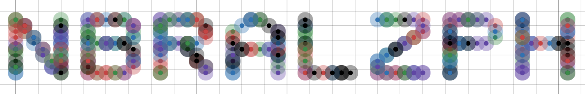

## Day 10 Solutions

This solution is a bit different. It uses [Desmos](https://www.desmos.com/calculator), a graphing calculator to simulate the movement of points across time. I parsed the input into a series of coordinates determined by a parameter `t` (time). Then I pasted the output into Desmos and incremented `t` until the points formed a readable word. For this input, the value of `t` was `10454`.

I may revisit this and come up with a solution that involves more Swift coding.

## Screenshot (`t = 10454`):

Word: **NBRALZPH**
